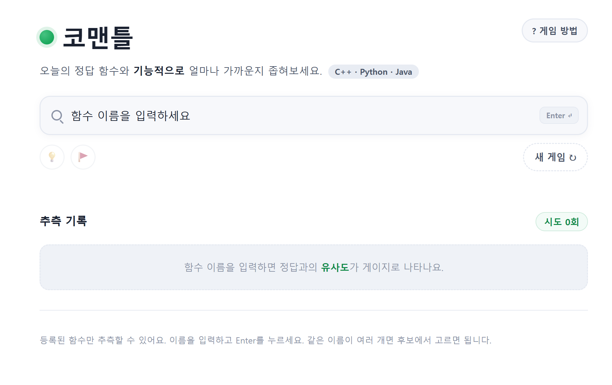

# 코맨틀 (Comantle)



C++ · Python · Java 함수를 **기능적 유사도**로 맞히는 추론 게임. [Semantle](https://semantle.com/)·[꼬맨틀](https://semantle-ko.newsjel.place/)의 프로그래밍 함수 버전입니다.

오늘의 정답 함수가 하나 정해지고, 함수 이름을 입력하면 그 함수가 정답과 **기능적으로 얼마나 가까운지** 0~100 점수로 알려줍니다. 점수가 높은 함수를 단서 삼아 정답을 좁혀 갑니다. 이름의 철자가 아니라 *하는 일*로 가까움을 잰다는 점이 핵심입니다 — 예를 들어 정답이 `printf`라면, 같은 "출력" 기능을 하는 `cout`·`System.out.println`이 높은 점수를 받습니다.

## 무엇이 다른가

이 프로젝트의 핵심은 **점수를 만드는 방식과 그것을 지키는 방식**입니다.

### 1. 점수 = 설명문 임베딩의 코사인 유사도 (사전계산)

각 함수에는 기능을 서술한 한국어 설명문이 있습니다. 이 설명문을 문장 임베딩 모델(`paraphrase-multilingual-MiniLM-L12-v2`)로 벡터화하고, 함수쌍의 **코사인 유사도**를 점수로 씁니다. 기능이 비슷한 함수는 설명문 벡터가 가까워지므로, 언어가 달라도(`push_back`↔`append`↔`add`) 자연스럽게 높은 점수가 나옵니다.

중요한 점은 이 계산을 **빌드 단계에서 미리** 끝내 점수표(`scores.json`)로 캐시한다는 것입니다. 런타임에는 임베딩 모델을 전혀 돌리지 않고 점수표를 룩업만 합니다. 덕분에 서버가 가볍고(무거운 ML 의존성 불필요), 응답이 빠르며, 매끄러운 점수 경사를 얻습니다.

### 2. 부정 방지 — 점수와 정답을 서버가 쥔다

정답을 미리 알 수 없어야 게임이 성립하므로, 점수표와 정답은 클라이언트에 내려보내지 않습니다.

- **점수표(`scores.json`)는 서버 메모리에만** 올려 룩업한다. 클라이언트로 전송하지 않는다.
- **정답 여부 판정은 서버가** 한다. 프론트는 `/api/guess`의 `correct` 플래그만 신뢰한다(점수로 추론하지 않음).
- **정답 단서**(정답 id·이름·설명·top100)는 정답을 맞히거나 포기한 뒤에만 응답에 실린다.
- 정답은 **날짜 시드 + 비밀 솔트**로 결정한다. 해시 알고리즘이 공개돼 있어도, 솔트(서버 환경변수)를 모르면 미래 정답을 계산할 수 없다. 클라이언트에 내려가는 함수 목록은 순서를 섞어, 인덱스로 정답을 역산하는 것도 막는다.
- **유저 상태를 서버에 저장하지 않는다(DB 없음).** 진행 기록은 브라우저 `localStorage`에만 둔다.

## 아키텍처

```
comantle/
├─ frontend/            정적 프론트엔드 (HTML/CSS/JS, 빌드툴 없음)
│   ├─ index.html
│   ├─ app.js           API로 점수를 받아 표시만 — 점수 계산을 하지 않는다
│   └─ style.css
├─ backend/             FastAPI 서버 (룩업 전용, DB 없음)
│   ├─ main.py          엔드포인트 (/api/today, /api/guess, /api/giveup, /api/hint)
│   ├─ game.py          날짜+솔트로 정답 결정 + 점수표 룩업
│   ├─ data/            functions.json, scores.json (서버 전용 — 클라 비공개)
│   ├─ Dockerfile
│   ├─ requirements.txt
│   └─ run.ps1 / run.sh
├─ pipeline/            점수표 생성 (개발 전용, 배포에 미포함)
│   ├─ build_scores.py  설명문 임베딩 → 코사인 → scores.json 생성
│   ├─ sync_data.py     pipeline/ 산출물 → backend/data/ 동기화
│   ├─ gradient_probe.py 점수 경사 검증 도구
│   ├─ functions.json   데이터 원본 (여기서 편집)
│   └─ scores.json      빌드 산출물
├─ docker-compose.yml
└─ README.md
```

**데이터 흐름은 한 방향입니다.** `pipeline/`에서 `functions.json`을 편집하고 점수표를 빌드한 뒤, `sync_data.py`로 `backend/data/`에 복사합니다. 서버는 자기 폴더(`backend/data/`)만 읽습니다 — 무거운 빌드 도구를 배포에서 분리하기 위함입니다(빌드 = 공장, 서버 = 매장).

현재 함수 풀: **386개** (C++ 117 / Python 121 / Java 148).

## 기술 스택

- **프론트엔드:** 순수 HTML/CSS/JavaScript (프레임워크·빌드툴 없음)
- **백엔드:** FastAPI + Uvicorn (Python)
- **점수 파이프라인:** sentence-transformers (`paraphrase-multilingual-MiniLM-L12-v2`)
- **저장소:** 없음 (정답은 날짜로 결정, 진행은 localStorage)

## 로컬 실행

### 1. 환경 변수 설정

`backend/.env.example`을 복사해 `backend/.env`를 만들고 값을 채웁니다. (`.env`는 git에 올리지 않습니다.)

```
COMANTLE_SALT=아무_긴_무작위_문자열   # 정답 결정용 비밀값. 한 번 정하면 고정.
COMANTLE_DEV=1                        # 개발 전용. 운영에서는 비우거나 0.
COMANTLE_ALLOWED_ORIGINS=http://localhost:5173,http://127.0.0.1:5173
```

> `COMANTLE_DEV=1`은 `?date=`로 임의 날짜의 정답을 띄울 수 있게 하는 **개발 전용** 스위치입니다. 운영 배포에서는 반드시 끄세요(켜면 미래 정답을 미리 볼 수 있어 부정 방지가 무력화됩니다).

### 2. 백엔드

```bash
cd backend
./run.sh          # Windows: ./run.ps1
# .env 값을 환경에 올리고 http://127.0.0.1:8000 에서 기동
```

또는 Docker:

```bash
docker compose up --build
```

### 3. 프론트엔드 (정적 서버)

```bash
cd frontend
py -3.13 -m http.server 5173
# http://localhost:5173 접속
```

### 점수표 갱신 (함수 추가/수정 시)

```bash
cd pipeline
python build_scores.py     # functions.json 편집 후 → scores.json 재생성 + 검증
python sync_data.py        # backend/data/ 로 동기화
# 서버 재시작 (메모리에 새 점수표 반영)
```

## 설계 노트

- **반의어가 가깝게 나오는 한계.** 임베딩은 "같은 맥락에서 쓰이는가"를 보므로, 하는 일이 반대인 함수(`push_back`↔`pop_back`)도 점수가 높게 나옵니다. 이는 모델의 본질적 특성이라 완전히 없앨 수 없고, 점수를 인위적으로 보정하지 않고 설명문 작성으로만 다뤘습니다. (꼬맨틀에서 "사랑"과 "증오"가 가까운 것과 같은 현상입니다.)
- **점수를 손으로 보정하지 않는다.** 모든 점수는 임베딩 코사인에서만 나옵니다. 특정 함수쌍을 예외 처리하면 점수 경사에 절벽이 생기고 일관성이 깨지므로, 변별이 필요하면 점수가 아니라 *설명문*을 조정했습니다.

## 라이선스

MIT License
